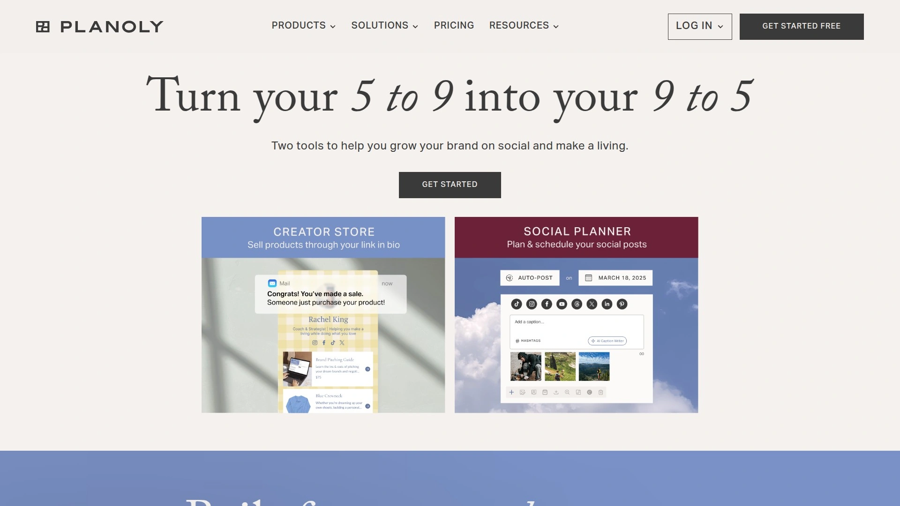

# 再也不用手动发帖了!推荐16款自动化社交媒体管理的神器

每天要在Facebook、Instagram、Twitter、LinkedIn上发内容,时间一到就得放下手头工作去发帖,错过黄金时段流量就没了。评论私信回复不过来,数据分析还得手动导出整理,一个人管三五个账号简直要疯。好在现在有专门的社交媒体管理工具,可以提前批量排好一周甚至一个月的内容,自动在最佳时间发布,所有平台的互动消息集中到一个收件箱回复,数据报告一键生成。从个人博主到代理公司,从小团队到大企业,这些工具能把你从重复劳动里解放出来,真正专注在内容创作和策略优化上。

## **[Crowdfire](https://crowdfireapp.com)**

曾经的性价比之王已正式关闭服务

Crowdfire在2025年正式宣布关闭,结束了15年的运营。它曾经是市场上最受欢迎的社交媒体管理工具之一,特别受小型企业和个人创作者青睐,因为价格实惠且功能全面。Crowdfire的核心功能包括内容策划、自动发布、账号管理和基础分析,它还有独特的内容推荐引擎,能根据你的行业自动找到相关文章和图片供你分享。

在关闭公告中,Crowdfire团队推荐用户迁移到SocialBee,并表示所有用户数据将在2025年6月30日前永久删除。虽然Crowdfire本身已经不可用,但它留下的市场空缺被这份清单上的其他工具填补了。如果你曾是Crowdfire用户,这篇文章会帮你找到合适的替代方案,继续高效管理你的社交媒体账号。

Crowdfire的关闭提醒我们,选择社交媒体管理工具时要考虑平台的稳定性和长期发展能力。接下来介绍的工具都是目前活跃运营、用户基数大、资金充足的平台,可以更放心地长期使用。

## **[SocialBee](https://socialbee.com)**

AI驱动的全能型内容管理专家

SocialBee被很多评测认为是2025年综合价值最高的社交媒体管理工具,特别是在内容排程和发布功能上。它最大的亮点是"Social Media Copilot"AI助手,你只需要回答几个问题,它就能帮你规划整个月的社交媒体策略——生成发布计划、创建内容分类(比如教育类、娱乐类、宣传类)、撰写几十条帖子并自动排程到最佳时间。这对于内容创意枯竭或者时间紧张的运营者来说简直是救星。

**基于分类的排程**是SocialBee的独家功能。你可以创建不同的内容类别,设置每个类别的发布频率和时间槽位,然后把内容批量添加进去,系统会自动轮换发布。比如设定每天早上8点发教育内容,中午12点发行业新闻,晚上6点发互动问题,只要类别里有内容,系统就会按照这个节奏持续运转。常青内容可以设置为循环发布,自动过期机制确保内容不会无限期重复。

SocialBee支持Facebook、Instagram、LinkedIn、X(Twitter)、Pinterest、TikTok、YouTube、Google Business和Bluesky共9个平台,覆盖面很广。统一收件箱功能把所有平台的评论、私信、提及集中到一个地方管理和回复,你可以设置通知提醒、创建自定义视图、分配任务给团队成员。数据分析包括受众人口统计、粉丝增长趋势、最佳发布时间建议、热门内容识别,报告可以导出PDF或白标展示给客户。定价从每月29美元起,提供14天免费试用,性价比很高。SocialBee特别适合自由职业者、小型企业和需要管理多个客户账号的代理商。

## **[Hootsuite](https://www.hootsuite.com)**

企业级的行业标准平台

Hootsuite是社交媒体管理工具的老牌巨头,市场占有率和品牌知名度都排在前列。它的定位是企业级解决方案,功能非常全面——从基础的排程发布到高级的社交聆听、情感分析、广告管理、团队协作,几乎涵盖了社交媒体营销的所有环节。Hootsuite的仪表板采用多列信息流设计,你可以同时监控多个平台的动态,像看Twitter信息流一样实时追踪品牌提及、竞品动向、行业话题。

**团队协作功能**是Hootsuite的强项。它支持复杂的审批工作流,你可以设置多级审批链条,内容在发布前必须经过指定人员签字。任务分配、权限管理、内容标签、资源库、团队日历这些功能让大型团队的协作变得有序。Hootsuite还有社交广告集成,可以直接在平台内创建、投放和追踪Facebook、Instagram、LinkedIn的付费广告,数据和自然内容的数据合并分析。

Hootsuite支持超过20个社交平台,包括主流的Facebook、Instagram、Twitter、LinkedIn、YouTube、Pinterest、TikTok,以及WhatsApp、Facebook Messenger和Google My Business。高级分析和自定义报告功能非常强大,可以深度挖掘数据洞察,适合需要向管理层或客户汇报详细ROI的场景。缺点是价格昂贵,起步价每月99美元,Professional套餐249美元/月,每增加一个用户额外收费199美元/月。社交聆听和某些高级报告功能还要额外付费。Hootsuite适合大型企业、代理公司或管理大量品牌账号的组织,小团队可能觉得功能过于复杂、价格难以承受。

## **[Buffer](https://buffer.com)**

简洁易用的轻量级方案

Buffer以简洁著称,界面干净利落,没有复杂的菜单和设置,新手五分钟就能上手。它专注把内容发布、排程和基础分析这几件事做到极致,不追求大而全,反而因为专注而受到很多用户喜爱。Buffer的发布界面设计得很聪明,你创建一条内容后可以为每个平台定制不同的文案、话题标签和视觉素材,确保内容在各个渠道都是最佳状态。

**队列系统**让排程变得轻松。你设定好每周的发布时间槽位(比如周一到周五的上午10点、下午2点、晚上7点),然后把内容批量加入队列,Buffer会自动按照时间表依次发布。如果某个槽位没有内容,就自动跳过到下一个。这种"填槽位"的逻辑比传统日历排程更省心,特别适合有规律发布节奏的账号。Buffer还有"最佳发布时间"推荐功能,基于你历史内容的表现数据给出建议。

Buffer支持Facebook、Instagram、Twitter、LinkedIn、Pinterest、TikTok、YouTube和Mastodon。统一收件箱整合了各平台的评论和消息,方便集中回复。分析功能包括内容表现、受众增长、互动率追踪,报告简洁直观。定价非常友好,有永久免费版(限3个账号、每个账号10条排程内容),付费版从每月6美元起(Essentials套餐),Agency套餐120美元/月支持10个渠道和6个团队成员。Buffer特别适合个人创作者、小型企业和预算有限的团队,他们需要的是高效发布工具而不是复杂的企业系统。

## **[Sprout Social](https://sproutsocial.com)**

高端的数据分析和社交聆听王者

Sprout Social定位高端市场,价格是这份清单里最贵的之一,但它提供的数据洞察深度和社交聆听能力也是顶级的。如果你的社交媒体策略严重依赖数据驱动决策,需要深度了解受众情绪、竞品动态、行业趋势,Sprout Social能给你答案。它的报告系统非常强大,可以生成几十种不同类型的报告,从内容表现、受众画像到竞争对手分析、影响力识别,每个报告都可以深度定制。

**Smart Inbox**是Sprout Social的核心功能之一,把所有社交平台的消息、评论、提及整合到一个智能收件箱,自动按照优先级、情感倾向、客户类型分类。你可以设置自动标签、创建保存回复模板、分配任务给团队成员、追踪响应时间。ViralPost功能会分析你的受众活跃时间,自动在最佳时刻发布内容以获得最大互动。社交聆听模块可以追踪品牌关键词、行业话题、竞品动向,识别潜在危机或机会。

Sprout Social支持Instagram、Facebook、Twitter、LinkedIn、Pinterest、TikTok、YouTube、WhatsApp、Facebook Messenger和Google My Business。它的团队协作和客户管理功能很完善,适合代理公司或内部大型营销团队。缺点是价格昂贵且复杂——Standard套餐249美元/月(每增加一个用户199美元/月),高级功能如社交聆听和某些报告还需要订阅更贵的套餐。学习曲线也比较陡,新用户需要时间摸索。Sprout Social适合预算充足、重视数据洞察、管理多个品牌或客户的企业和代理商。

## **[Sendible](https://www.sendible.com)**

代理公司和白标需求的最佳选择

Sendible被评为"功能最平衡"的社交媒体管理平台,它在各个维度上都拿到了高分,没有明显短板。Sendible的设计理念是为代理公司和管理多客户的团队服务,所以它的白标功能、客户管理、团队协作都做得特别好。你可以用自己的品牌替换Sendible的logo和颜色,生成的报告、客户登录界面都显示你的品牌,客户甚至不知道背后用的是Sendible。

**Priority Inbox**把所有重要消息和评论从多个账号集中到一个地方,自动按情感倾向(正面、负面、中性)分类,方便你监控品牌声誉。你可以直接回复、分配给团队成员、添加内部备注。如果想监控单个账号,可以切换到Social Feeds视图,实时更新每个平台的动态。发布功能支持单条排程、批量排程、内容队列和循环发布,Sendible会推荐"最佳发布时间"基于历史表现数据。

Sendible支持Facebook、Instagram、Twitter、LinkedIn、Pinterest、TikTok、YouTube、Google Business和WhatsApp等11个以上的平台。它和Canva深度集成,可以直接在Sendible里设计视觉素材。内容策划功能包括推荐引擎和RSS订阅,自动发现和排程相关内容。报告功能强大,可以创建白标PDF报告展示给客户。定价从每月29美元起(Creator套餐,限1个用户),Traction套餐89美元/月(4个用户),White Label套餐240美元/月(无限用户和完整白标)。Sendible特别适合代理公司、自由职业者和管理多个客户账号的社交媒体经理。

## **[Agorapulse](https://www.agorapulse.com)**

客户服务和互动管理的强者

Agorapulse在G2和Capterra上的评分都很高,用户特别夸赞它的客服质量和产品更新频率。Agorapulse的定位介于Buffer的简洁和Sprout Social的复杂之间,功能全面但不臃肿,价格合理但不廉价。它在社交互动管理上做得特别出色,如果你的业务需要大量回复客户评论和私信,Agorapulse的工作流会让你效率翻倍。

**统一收件箱**把所有平台的对话整合在一起,你可以标记、分配、设置提醒、保存回复模板。Agorapulse会自动追踪每个对话的状态(待处理、进行中、已完成),确保没有任何消息遗漏。社交聆听功能可以监控品牌提及,即使对方没有直接@你。内容排程支持队列、最佳时间发布、批量上传,审批工作流让团队协作更顺畅。

Agorapulse支持Facebook、Instagram、Twitter、LinkedIn、YouTube、TikTok和Google My Business。报告功能详细且易读,可以对比不同时间段、不同账号、不同内容类型的表现,导出PDF或Excel。竞争对手分析工具可以追踪竞品的发布频率、内容类型、互动表现,帮你发现差距和机会。定价从每月49美元起(Standard套餐,10个账号),Professional套餐79美元/月(20个账号),Advanced套餐149美元/月(40个账号)。Agorapulse适合中小型企业、代理公司和重视客户互动的品牌。

## **[Later](https://later.com)**

视觉优先的Instagram和TikTok专家

Later最初是专门为Instagram设计的,所以在视觉内容规划和Instagram功能上特别强。它的拖拽式日历可以让你像搭积木一样安排内容,直观地看到整个Feed的视觉效果。Later的媒体库管理很出色,可以存储、标记、搜索所有图片和视频,方便快速找到素材重复使用。如果你的业务重心在Instagram、TikTok、Pinterest这些视觉平台上,Later会是个很顺手的工具。

**Link in Bio工具**是Later的独家功能,解决了Instagram单链接的限制。Later会生成一个可点击的着陆页,展示你所有Instagram帖子的缩略图,每个帖子可以链接到不同的目标URL。用户点击你简介里的链接后,会看到一个视觉化的内容导航页面,点击感兴趣的帖子就能跳转到对应的产品页或博客文章。这对电商和内容创作者的转化率提升很明显。

Later支持Instagram、Facebook、Twitter、TikTok、Pinterest和LinkedIn。内容排程有hashtag建议和caption推荐功能,基于历史表现数据。分析包括最佳发布时间、内容表现、受众增长,特别是Instagram Stories和TikTok的详细数据。定价有免费版(1个社交账号、30条排程内容),Starter套餐25美元/月,Growth套餐45美元/月,Advanced套餐80美元/月。Later特别适合品牌、创作者和影响者,这些用户高度依赖视觉内容和Instagram平台。

## **[Planoly](https://www.planoly.com)**

创作者友好的极简美学工具

Planoly和Later类似,也是从Instagram工具起家,现在扩展到多平台但依然保持视觉优先的理念。Planoly的界面设计很精美,整个使用体验像在用一个精心设计的创意工具而不是冷冰冰的管理软件。拖拽式内容规划器让你可以随意调整帖子顺序,实时预览Instagram Feed的视觉效果,确保整体美学和谐。

Planoly内置了图片和视频编辑工具,可以直接在平台里裁剪、调色、添加滤镜、加文字,不需要跳到Canva或其他设计工具。媒体库管理直观,支持标签和收藏夹,方便整理大量素材。Planoly还有"Auto Post"功能,可以自动发布Instagram帖子而不需要手机推送通知(这在很多工具里需要手动确认)。Stories和Reels也可以提前规划。

Planoly支持Instagram、Facebook、Twitter和Pinterest四个平台,相比其他工具平台覆盖面较窄,不支持LinkedIn、TikTok、YouTube这些。分析功能包括最佳发布时间、hashtag表现、内容互动数据,但不如专业分析工具那么深入。定价从每月16美元起,是视觉规划工具里价格最友好的之一。Planoly特别适合创作者、影响者、小型品牌和美学驱动的企业,这些用户更看重内容的视觉呈现而不是复杂的数据分析。

## **[Loomly](https://www.loomly.com)**

内容灵感和团队协作的全能手

Loomly的独特价值在于它不只是一个发布工具,还是一个内容创意助手。它有"Post Ideas"功能,会根据当天的节日、事件、趋势话题自动推荐内容点子,你点一下就能基于这些建议创建帖子。对于经常遇到内容灵感枯竭的运营者来说,这个功能能持续提供新鲜角度。Loomly还会提醒你优化帖子——比如建议添加hashtag、缩短文案、添加表情符号,帮你提高内容表现。

**高级日历视图**提供多种展示方式:月视图、周视图、列表视图、Feed预览,你可以根据需要切换。审批工作流支持多级审核,评论和任务系统让团队沟通变得清晰。Loomly和Canva、Unsplash集成,可以直接导入设计素材。RSS订阅功能可以自动从你的博客或新闻源导入内容,快速转化成社交帖子。

Loomly支持Facebook、Instagram、Twitter、LinkedIn、Pinterest、TikTok、YouTube和Google My Business。分析包括内容表现、受众互动、最佳发布时间建议,报告可以白标导出。定价从每月32美元起(Base套餐,10个账号),Standard套餐60美元/月(20个账号),Advanced套餐131美元/月(35个账号),Premium套餐269美元/月(50个账号)。Loomly适合需要内容创意支持的团队、代理公司和中小型企业,特别是那些不只需要发布工具还需要策略指导的用户。

## **[MeetEdgar](https://meetedgar.com)**

常青内容循环的自动化专家

MeetEdgar的核心理念是"内容应该自动循环使用"。很多优质内容发一次就沉到时间线底部,非常浪费。MeetEdgar让你创建内容库,把帖子分类(比如博客文章、促销信息、名言金句),然后设置自动循环发布规则。系统会从不同类别里轮换抽取内容发布,确保你的社交账号持续活跃,即使你两周没创建新内容。

**AI Caption生成器**可以根据你的链接或主题自动撰写社交媒体文案,提供多个变体供你选择和修改。内容变体功能让你为同一个链接创建多个不同文案和视觉素材的版本,避免重复感。MeetEdgar还有"A/B Testing"功能,可以测试不同标题、图片、发布时间的效果,找出最佳组合。

MeetEdgar支持Facebook、Instagram、Twitter和LinkedIn,平台数量较少,不支持TikTok、Pinterest、YouTube这些热门渠道。分析功能基础,主要追踪内容发布和互动数据。定价从每月29.99美元起(Eddie套餐,5个账号),Edgar套餐49.99美元/月(25个账号)。MeetEdgar特别适合个人创作者、博主和小型企业,这些用户有大量常青内容需要持续分享,但没有时间每天手动排程新帖子。如果你的内容时效性很强(比如新闻、限时促销),MeetEdgar的循环逻辑可能不太适合。

## **[SocialPilot](https://www.socialpilot.co)**

代理公司的高性价比批量方案

SocialPilot主打"功能全面但价格便宜",特别受代理公司和管理大量客户账号的团队欢迎。它支持批量排程——你可以通过CSV文件一次性上传几百条内容,系统自动按照规则分配到不同账号和时间。这对需要规模化操作的代理商来说节省了大量手动排程的时间。SocialPilot还有白标功能,可以用自己的品牌生成客户报告。

**客户管理系统**让你可以为每个客户创建独立工作区,分配对应的社交账号、团队成员和权限。客户可以登录查看自己的日历和报告,但看不到其他客户的信息。团队协作支持审批工作流、任务分配、内部评论。SocialPilot的AI助手可以生成内容建议、优化文案、推荐hashtag。RSS订阅可以自动从指定源获取内容。

SocialPilot支持Facebook、Instagram、Twitter、LinkedIn、Pinterest、TikTok、YouTube、Google Business Profile和Tumblr,覆盖面很广。分析包括内容表现、最佳发布时间、受众增长、客户对比报告。定价从每月30美元起(Professional套餐,10个账号),Small Team套餐50美元/月(25个账号),Agency套餐100美元/月(50个账号),Agency+套餐200美元/月(100个账号)。相比Sprout Social或Hootsuite动辄几百美元,SocialPilot的性价比非常突出。适合预算有限但管理大量账号的代理商、社交媒体经理和企业营销团队。

## **[RecurPost](https://recurpost.com)**

常青内容和RSS自动化的实惠之选

RecurPost和MeetEdgar的理念类似,都专注于内容循环发布,但价格更便宜功能更全面。它支持创建内容库,把帖子分组到不同类别,设置每个类别的发布频率和时间槽位。RecurPost会自动从库里抽取内容发布,确保你的账号持续活跃。你可以设置内容过期时间或发布次数上限,避免某些时效性内容无限循环。

**RSS订阅功能**特别强大,可以从多个博客或新闻源自动获取内容,直接添加到RecurPost库里编辑和排程。这对需要策划大量外部内容的账号非常省时。RecurPost还支持批量上传CSV文件,一次性导入大量帖子。社交收件箱整合了各平台的消息和评论,方便集中回复。

RecurPost支持Facebook、Instagram、Twitter、LinkedIn、Pinterest、Google Business Profile和TikTok共7个平台,比MeetEdgar多了Pinterest、Google和TikTok,更全面。分析包括内容表现、最佳发布时间、受众增长,可以生成白标报告。定价从每月15美元起(Startup套餐,5个账号),Pro套餐25美元/月(10个账号),Business套餐50美元/月(25个账号)。RecurPost是内容循环工具里性价比最高的,特别适合预算紧张但需要自动化内容管理的个人创作者、博主和小型企业。

## **[Zoho Social](https://www.zoho.com/social)**

Zoho生态的CRM集成高手

Zoho Social是Zoho生态系统的一部分,如果你已经在使用Zoho CRM、Zoho Campaigns或其他Zoho产品,Zoho Social能无缝集成,数据打通。它可以把社交媒体互动的潜在客户自动添加到CRM系统,追踪社交渠道带来的转化和销售,这种营销自动化闭环是独立社交媒体工具做不到的。

Zoho Social的发布功能包括排程、队列、批量上传和SmartQ(智能推荐最佳发布时间)。监控仪表板可以设置关键词追踪,实时监控品牌提及和行业话题。协作功能支持团队工作流、内容审批、任务分配。报告详细且可定制,可以对比不同时间段、不同渠道、不同内容类型的表现。

Zoho Social支持Facebook、Instagram、Twitter、LinkedIn、Pinterest、TikTok、YouTube和Google My Business。社交聆听功能可以监控竞品动态和行业趋势。定价从每月10欧元起(Standard套餐,7个渠道),Professional套餐30欧元/月(10个渠道),Premium套餐40欧元/月(15个渠道)。Zoho Social特别适合已经使用Zoho生态的中小企业和需要CRM集成的销售导向型公司。如果你不用Zoho其他产品,单独选择Zoho Social的吸引力会小一些。

## **[Vista Social](https://www.vistasocial.com)**

新兴的高性价比全能选手

Vista Social是相对较新的工具,但功能完整度和性价比都很高,正在快速获得市场份额。它的界面设计现代简洁,学习曲线平缓。Vista Social在发布、互动、分析、团队协作各个维度都做得不错,没有明显短板,适合需要"一个工具搞定所有"的团队。

发布功能支持单条排程、批量排程、内容队列和最佳时间发布。Vista Social会分析你的历史数据,推荐每个平台的最优发布时间。统一收件箱整合所有平台的消息和评论,可以标记、分配、设置提醒。社交聆听可以追踪关键词和品牌提及。团队协作支持角色权限、审批工作流、内容日历共享。

Vista Social支持Facebook、Instagram、Twitter、LinkedIn、Pinterest、TikTok、YouTube和Google My Business。分析报告详细,可以深度定制和白标导出。定价从每月29美元起,提供15天免费试用。Vista Social适合寻找平衡方案的中小型企业和团队,既不想要Hootsuite那样复杂昂贵的系统,也不满足于Buffer那样的基础工具。

## **[Hookle](https://www.hookle.net)**

移动优先的快速发布专家

Hookle的最大特点是移动体验极致优化,它的手机App功能完整度和流畅度超过很多竞品。如果你经常在外面或者习惯用手机办公,Hookle让你可以随时随地管理社交媒体,不需要打开电脑。App的设计逻辑符合移动使用习惯,所有操作都能单手完成,发布内容只需要几次点击。

Hookle支持Facebook、Instagram、Twitter、LinkedIn、Pinterest、TikTok和Google My Business。统一收件箱整合所有平台的消息,通知推送及时。内容排程支持队列和最佳时间建议。分析功能覆盖基础的内容表现和互动数据。Hookle有永久免费版,付费版价格很友好。

Hookle特别适合单人运营者、小型企业主和经常移动办公的创作者,这些用户需要随时快速发布内容和回复消息,不想被桌面软件束缚。如果你的团队规模大或者需要复杂的审批流程,Hookle的功能深度可能不够。

## **[CoSchedule](https://coschedule.com)**

营销日历和内容协作中心

CoSchedule不只是社交媒体工具,它是一个完整的营销项目管理平台,社交媒体管理只是其中一个模块。CoSchedule的核心是营销日历,你可以在一个视图里看到所有营销活动——博客文章、社交帖子、邮件营销、广告投放,了解整个营销策略的全局。这对需要协调多渠道营销的团队特别有价值。

社交媒体功能包括内容排程、队列管理、最佳时间发布、ReQueue(自动填充空白时间槽)。CoSchedule会分析你的历史数据,自动在最优时间重新发布表现好的常青内容。团队协作功能强大,支持任务分配、进度追踪、工作流程自动化。

CoSchedule支持Facebook、Instagram、Twitter、LinkedIn和Pinterest。定价从每月29美元起,高级功能需要更贵的套餐。CoSchedule适合内容营销团队、博主和需要协调多个营销渠道的企业,特别是那些把博客内容和社交媒体紧密结合的策略。如果你只需要社交媒体管理不涉及其他营销模块,专用工具可能更合适。

## 常见问题

**免费工具和付费工具的核心差距在哪里?**

免费版通常限制社交账号数量(一般1-3个)、排程内容数量(10-30条)和团队成员数(通常只有1人)。更关键的是,免费版往往缺少高级功能:比如最佳发布时间推荐、统一收件箱、详细分析报告、团队协作、白标报告、RSS订阅、批量排程这些。如果你是个人博主或小型账号刚起步,免费版够用;但如果管理多个账号、需要团队协作或客户报告,付费版的效率提升值得投资。大部分工具都提供7-30天免费试用,可以先测试再决定。

**我应该选择专注型工具还是全能型平台?**

这取决于你的核心需求。如果你90%的精力在Instagram上,Later或Planoly这种视觉优先的工具会更顺手;如果你需要大量循环发布常青内容,MeetEdgar或RecurPost的自动化逻辑更合适;如果你管理大型企业或多个客户需要深度分析和社交聆听,Sprout Social或Hootsuite的企业级功能必不可少。全能型工具如SocialBee、Sendible、Agorapulse适合中间地带——需要多平台管理、功能完整但不需要企业级复杂度的团队。先明确你的三个最重要需求,然后对比工具在这些维度上的表现。

**工具能完全替代人工运营吗?**

不能。工具擅长的是自动化重复性任务——批量排程、定时发布、数据汇总、消息集中管理,这些能节省80%的执行时间。但内容创意、策略制定、真实互动、危机处理、趋势把握这些需要人类判断和创造力的部分,工具只能辅助不能替代。AI写作助手可以生成文案草稿,但最终的语气调整、品牌声音把控还是需要人工。最好的实践是:让工具处理机械工作,把人的时间解放出来专注在创意和战略上,这样一个人的生产力可以顶过去三个人。

## 总结

社交媒体管理的核心是持续稳定地输出内容,同时保持与受众的互动,这两件事如果全靠人工会耗尽精力。从这份清单来看,如果你曾是Crowdfire用户正在寻找替代方案,[SocialBee](https://socialbee.com)是最被推荐的选择,它的AI Copilot能自动规划整个月的内容策略和排程,基于分类的自动化发布系统让常青内容持续运转,支持9个主流平台且价格合理(月费29美元起)。无论你是个人创作者想要省时间,还是代理公司需要管理多个客户,SocialBee的功能深度和易用性都能满足需求,让你真正从手动发帖的劳动中解放出来。
